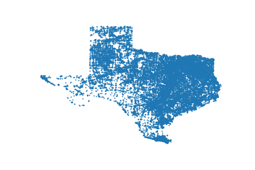
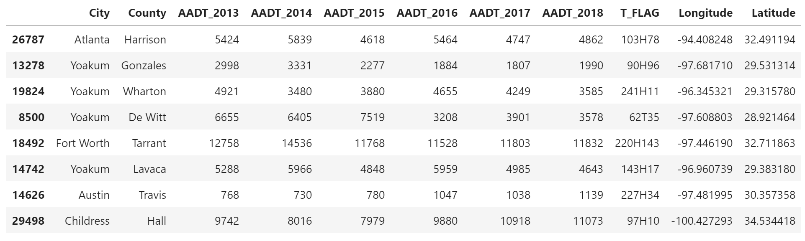
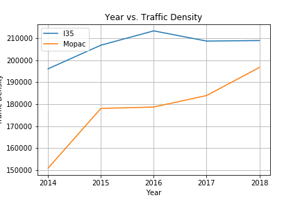

# Project1---Team_BigBend

#### Introduction

For our project we decided to take a look at one of the biggest problems everyone living in Austin deals with on a daily basis, traffic, and its relation to traffic incident rates. We have seen the levels of traffic volume grow over the years and wanted to find out if this increase in traffic volume had an effect on incident rates. To do this we collected traffic data for major highways and roads throughout the city and analyzed them for underlying patterns and trends in traffic volume over the years. Once we did this we collected data on traffic incidents throught Austin and compared compared changes in incident rates over the years and their relationship to the increasing traffic desnities 
 

## Annual Average Daily Traffic Data 

#### Data Retrival
To understand how motor vehicle incidents in Austin correlates with is a traffic, I thought it was important to show how traffic has changed in the the city. To calculate this we used the Annual Average Daily Traffic (AADT) and the data was retreived from TxDot (http://gis-txdot.opendata.arcgis.com/datasets/txdot-aadt-annuals). This data separates most columns by year and has a column named T_Flag which indicates the count station that the values are taken from. That DataFrame also has columns to represent the location of the count station. The Texas shaped figure above represents all the count stations in Texas. Below is an example of what the data looks like from TXdot API.  

#### Analysis
The two plots below show the AADT increase from 2014 to 2018. The graph on the left shows the increase of the closest counties that make up the Austin area. Hays County does not seem to make much of a change but Travis and Williamson County both increase by at least 2 to 2.6 million trips in the time period. The graph on the right helps visualize the total AADT inrease next to the increase of AADT in Travis County. The total AADT for the Austin area within these counties add close to 26,000,000 trips. With the increase in population into Austin it makes sense that there are more cars on the road per day increasing the trips taken.       

Using this data, I was able to calculate an estimate of the Traffic Density. The graph below shows the trend of traffic density from 2014 to 2018 on two of Austin's major Highways: I35 and Mopac. On Mopac, I chose the count station where Mopac crosses the Colorado River to the north point of Camp Mabry on Mopac. For I35, used the point next to 5th street and the counting station on I35 right below 290. The distance between each site on each highway is about 4 miles. Using these two points, I calculated traffic density by averaging the annual daily traffic between those points and then dividing the length between those points. Over the 5 year span the data was taken, I35 increased by 15,000 cars and on Mopac, the density increased by 45,000 cars. One factor that could have caused this increase on Mopac was the opening of the Toll Road. 

## Bluetooth Sensor Traffic Data 

#### Data Retrival

To better understand the traffic patterns and how they have changed over the years we pulled traffic data from numerous sources. A large portion of traffic data was collected from https://data.austintexas.gov/, where we pulled data from bluteooth travel sensors throughout the city. These bluetooth sensors are able to detect other bluetooth devices in cars and can track the travel time from one station to the next and provide us with a count of unique vehicles on the road at a given time. When a device is identified a random ID is assigned to the car which then enables the sensors to keep track of the vehicle as it 
The origin dataset consisted of over 88 million rows of data collected over the span of 5+ years. For our analysis we decided to take a look at the last three years from 2017 to 2019. Furthermore in order to refine our focus we decided to take a look at a collection of 5 major highways/roads within the city including US183, IH35, Lamar, Burnet, RM2222. Once all the data was collected we grouped the data by roads, year, and day of week. Breaking down the data into smaller groups enabled us to take the large set of data and create a plot that helped visualize the fluctuating levels of traffic density throughtout the year by day of week and compare them to average incident rates throughout the city. 

The first dataframe shown below is the raw data we recieve from the data.austin API, from here a series of transformations were applied to format and clean up the dataset so that it could be organized into specific roads, years, and hours as shown in the cleaned up dataset in the second dataframe. 

#### Analysis
The plot below shows a series of lines, the full lines represent a year from 2017 to 2019 and show the percentage of of vehicles recorded at a specific hour in relation to the total vehicles records throughout that year. From the plot we can see that on US183 traffic volumes have increased over 6% from 2017 at 8am on Mondays. This supports the trends presented in the average annual daliy traffic data. Although there hasn't been a significant increase in traffic volume at every hour of the day, we can see that in general there is a greater concentration of vehicles on the road at specific peak hours which can contribute to growing levels of traffic.

The dotted line shows the percent of traffic incidents recorded at each hour. We can see that there is not direct relationship in the early hours as incident rates actually seem to decrease as traffic volume grows. However as we approach the next set of peak hours around 3PM we can see that incident rate has already been increasing and remains at a higher level throughout later hours of the day. From the plot below we can see that on Saturdays the incident rates at 12am are extremely high despite a lower level of traffic volume. This high incident rate could be attributed to a variety of other factors such as drunk driving and other reckless behavior that is more common on weekend nights. 

Overall we can see that there is an increasing level of traffic volume, especially during peak hours but there doesn't seem to be a direct relationship between traffic volume and incident rates. However we can see that there does seem to be some relationship between the time of day and incident rates as they are much higher at later hours of the day. It is important to keep in mind that this data is not representative of all vehicles on the roads throughout the city as many cars on the road are not equipped with bluetooth devices. Furthermore a wide variety of factors can affect the accurate recording of data for the bluetooth stations such as weather, construction, accidents, seasonal travel patterns and much more. 

## Traffic Event Impact On Vehicle Speed

### Data Retrival

In order to illustrate the relationship between the number of traffic events to the vehicle speed on Lamar Blvd. we utilized data from two APIs hosted on <a href="https://data.austintexas.gov" rel="nofollow">data.austintexas.gov</a>. There was a sizeable amount of data so we narrowed the lens in this section to just Lamar Blvd. One API contained Bluetooth travel sensor data that showed the travel time and speed between various points. The second API listed traffic incident data. The Bluetooth data contained a large volume of records in which we stored the data on a MySQL database. We merged the two data sets into a single data frame to illustrate correlation between traffic events and vehicle speed. 

 

### Analysis

The figure below shows that as the number of incidents per day increases so does the percent decrease in vehicle speed. Also the point at which the the travel time exceeds the baseline is somewhere between nine to ten incidents.

