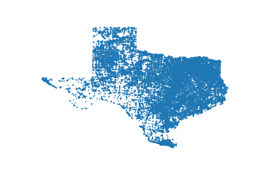
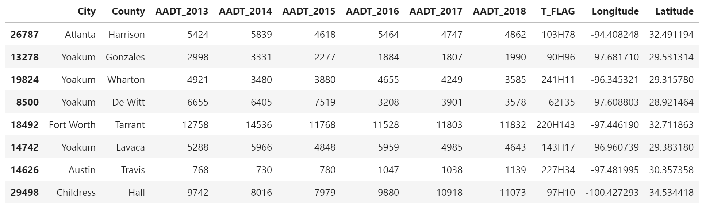
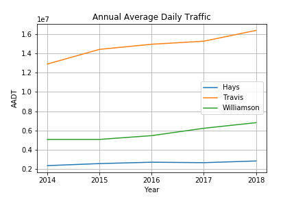
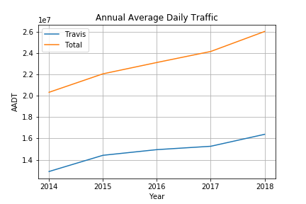
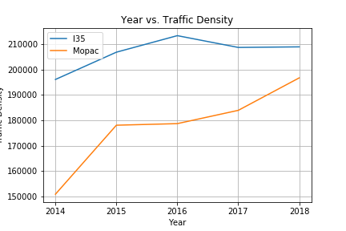

# Project1---Team_BigBend
 

#### Data Retrival
To understand how motor vehicle incidents in Austin correlates with is a traffic, I thought it was important to show how traffic has changed in the the city. To calculate this we used the Annual Average Daily Traffic (AADT) and the data was retreived from TxDot (http://gis-txdot.opendata.arcgis.com/datasets/txdot-aadt-annuals). This data separates most columns by year and has a column named T_Flag which indicates the count station that the values are taken from. That DataFrame also has columns to represent the location of the count station. The Texas shaped figure above represents all the count stations in Texas. Below is an example of what the data looks like from TXdot API.  

#### Analysis
The two plots below show the AADT increase from 2014 to 2018. The graph on the left shows the increase of the closest counties that make up the Austin area. Hays County does not seem to make much of a change but Travis and Williamson County both increase by at least 2 to 2.6 million trips in the time period. The graph on the right helps visualize the total AADT inrease next to the increase of AADT in Travis County. The total AADT for the Austin area within these counties add close to 26,000,000 trips. With the increase in population into Austin it makes sense that there are more cars on the road per day increasing the trips taken.       

Using this data, I was able to calculate an estimate of the Traffic Density. The graph below shows the trend of traffic density from 2014 to 2018 on two of Austin's major Highways: I35 and Mopac. On Mopac, I chose the count station where Mopac crosses the Colorado River to the north point of Camp Mabry on Mopac. For I35, used the point next to 5th street and the counting station on I35 right below 290. The distance between each site on each highway is about 4 miles. Using these two points, I calculated traffic density by averaging the annual daily traffic between those points and then dividing the length between those points. Over the 5 year span the data was taken, I35 increased by 15,000 cars and on Mopac, the density increased by 45,000 cars. One factor that could have caused this increase on Mopac was the opening of the Toll Road. 

#### Limitations
Some limitations when making the figures were finding the distance between the two count stations. Although the correct distance was calculated, we had to use streets that were perfectly straight. Streets that are curved could have been used but we would have needed different coordinated to calculated the distance on the roads to account for the turns. Another limitation was the average of trips. The two count stations I chose to represent the traffic density have exits and on ramps between them. If a car car enters or exits before the count station marker we might be missing on a more accurate traffic density during those points. 
