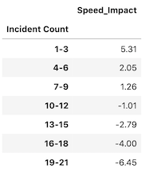

## Traffic Event Impact On Vehicle Speed

 

### Data Retrival

In order to illustrate the relationship between the number of traffic events to the vehicle speed on Lamar BLVD we utilized data from two APIs hosted on <a href="http://austin.data.gov" rel="nofollow" />austin.data.gov. One API contained bluetooth travel sensort data that showed the travel time and speed between various points. The second API listed traffic incident data. The bluetooth data contained a large volume of records in which we stored the data on a MySQL database. We merged the two data sets into a single data frame to illustrate correlation between traffic events and the travel time. 

 

### Analysis

The figure below shows that as the number of incidents per day increases so does the percent decrease in vehicle speed. Also the point at which the the travel time exceeds the baseline is somewhere between nine to ten incidents.

